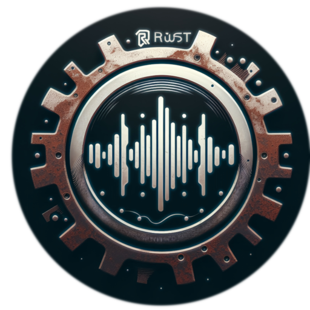

## RhythmiRust - Your Music, Your Way

> [!IMPORTANT]
> This repository serves as the official distribution hub for RhythmiRust releases, including binaries, release notes, and changelogs. Please note that the core application’s source code is closed source and not publicly available here. This repo is intended solely for convenient download and documentation purposes.

> [!IMPORTANT]
> This project is developed and maintained by a single creator. Your support and feedback are greatly appreciated as I continue to enhance and expand RhythmiRust.

**RhythmiRust** is a Rust-based music player, downloader, searcher and metadata editor designed for simplicity, efficiency and cross-platform compatibility.

---

### What's Included
- Latest stable release binaries for Windows and Linux
- Release notes for each version
- Changelog for each version

---

### Features
- Search and download music from YouTube, Spotify, SoundCloud, and more
- Lightweight and portable design with minimal system resources
- Album art support and metadata editing
- Cross-platform compatibility (Windows/Linux)
- Clean, distraction-free interface
- **Mass shuffle and autoplay**: shuffle your entire music collection and let it play automatically, so you can focus on gaming or other tasks without interruption

---

### Project Origin
RhythmiRust began as two Bash scripts for downloading and searching music. As the project grew, it evolved into a single application with a GUI, minimal dependencies, portability and a focus on memory footprint, performance, and user experience.

---

### Download Latest Release
[RhythmiRust Releases Page](https://github.com/UnknownSuperficialNight/RhythmiRust/releases/latest)

---

### Community & Support
- Want to help contribute to the wiki: [Wiki Repo](https://github.com/UnknownSuperficialNight/RhythmiRust-Wiki)
- Discord: [Discord](https://discord.gg/zDm4kb2GdK)
- Email: [Email](mailto:unknownsuperficialnight.skylight770@simplelogin.fr)

If you encounter any bugs, have questions, or want to suggest new features, please open an issue on the [GitHub Issues page](https://github.com/UnknownSuperficialNight/RhythmiRust/issues). Your feedback helps make RhythmiRust better for everyone!
