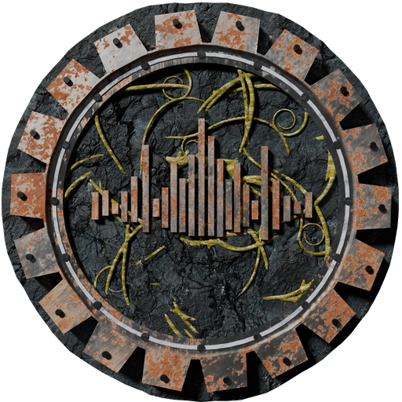

# RhythmiRust - Your Music, Your Way

> [!IMPORTANT]
> This repository serves as the official distribution hub for RhythmiRust releases, including binaries, release notes, and changelogs. Please note that the core application’s source code is closed source and not publicly available here. This repo is intended solely for convenient download and documentation purposes.
>
> RhythmiRust is developed and maintained by a single creator. Your support and feedback are greatly appreciated as I continue to enhance and expand it.

> [!WARNING]
> **Use RhythmiRust at your own risk.** You are responsible for complying with applicable laws, copyright requirements, licenses, and third-party terms of service. See the full [Disclaimer](#disclaimer).

**RhythmiRust** is a Rust-based music player, downloader, searcher and metadata editor designed for simplicity, efficiency and cross-platform compatibility.

---

### Screenshot

### Development Timelapse

---

### What's Included
- Latest stable release binaries for Windows and Linux
- Release notes for each version
- Changelog for each version

---

### Features
- Search and download music from YouTube, SoundCloud, Spotify (your own playlists and liked songs) and more
- Multithreaded downloads
- Download cache, so a URL that has already been downloaded is never downloaded twice
- Precedence order, so when the same song is in several folders, the one highest in your order is kept
- Dead or broken links are remembered and not retried
- Duplicate detection with advanced audio fingerprinting, with multiple detection levels
- Search your library with filters, such as song length, with a search cache that updates automatically
- Queue, history, favourites and song ratings
- Album art support, including folder album art, visual effects (CPU and GPU) and mass shuffling
- Metadata editing, with optional mass/bulk editing across multiple tables
- Bit-perfect playback and decoder support
- Playback speed control and automatic gain control
- Automatic updates for yt-dlp and Deno, and ffmpeg is downloaded and managed for you if it is not installed
- Lightweight and portable design with minimal system resources, or use a global config shared across installations
- Built-in wiki, available from inside the app (Top right of the screen)
- Cross-platform compatibility (Windows/Linux)

---

### Project Origin
RhythmiRust began as two Bash scripts for downloading and searching music. As the project grew, it evolved into a single application with a GUI, minimal dependencies, portability and a focus on memory footprint, performance, and user experience.

---

### Download Latest Release
[RhythmiRust Releases Page](https://github.com/UnknownSuperficialNight/RhythmiRust/releases/latest)

---

### Community & Support
- Want to help contribute to the wiki: [Wiki Repo](https://github.com/UnknownSuperficialNight/RhythmiRust-Wiki)
- Discord: [Discord](https://discord.gg/zDm4kb2GdK)
- Email: [Email](mailto:unknownsuperficialnight.skylight770@simplelogin.fr)

If you encounter any bugs, have questions, or want to suggest new features, please open an issue on the [GitHub Issues page](https://github.com/UnknownSuperficialNight/RhythmiRust/issues). Your feedback helps make RhythmiRust better for everyone!

---

## Disclaimer

RhythmiRust is provided “as is” and “as available,” without warranties of any kind, express or implied. You use RhythmiRust entirely at your own risk.

The developer is not responsible for any damage, data loss, system issues, security problems, legal claims, copyright or licensing violations, or other consequences resulting from the use, misuse, installation, modification, or distribution of RhythmiRust.

RhythmiRust may interact with third-party websites, platforms, services, APIs, or media sources. The developer does not control or endorse those third parties and is not responsible for their content, availability, terms of service, policies, or actions.

RhythmiRust also uses third-party tools such as yt-dlp, ffmpeg and Deno, which may be downloaded and updated automatically. These are separate projects with their own licenses, and they are not developed or maintained by the developer of RhythmiRust.

You are solely responsible for ensuring that your use of RhythmiRust complies with all applicable laws, regulations, copyright requirements, licenses, and third-party terms of service. You should only download, access, modify, or store content for which you have the necessary rights or permission.

By downloading, installing, or using RhythmiRust, you acknowledge and accept this disclaimer.
